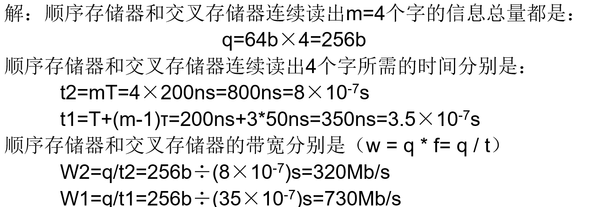
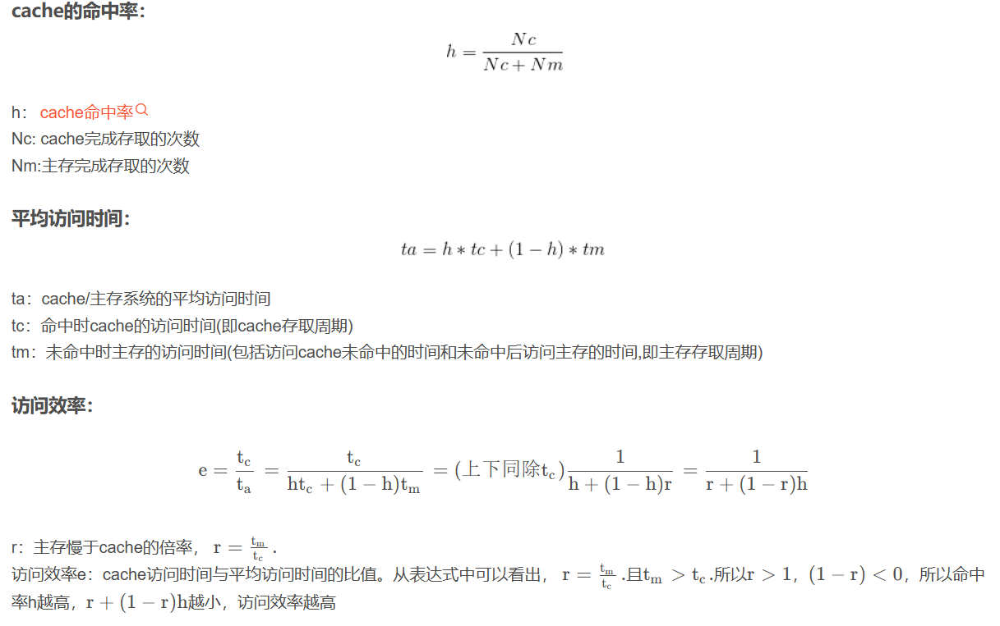
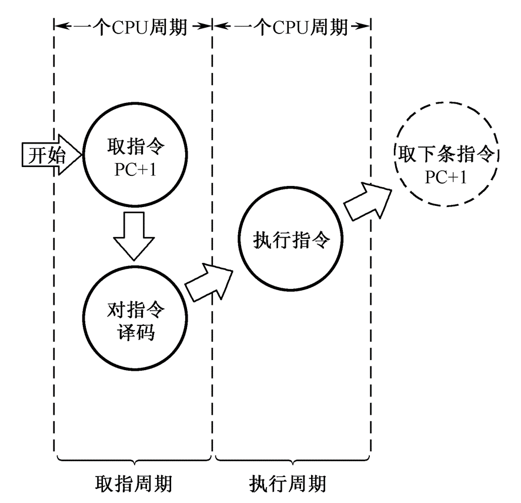

# 计算机组成原理
> 🖊任何不走心的努力都是敷衍你自己。

科目：计算机组成原理

日期：12/5

作者(不分先后)：刘方磊、陈子谦、蒋恒宇

## 1.填空题

 1.1机器指令中操作数数据类型包括(1) 地址数据(2) 数值数据(3) 字符数据(4) 逻辑数据

​      1.2 操作控制器可为数据通路的建立提供各种操作信号，根据设计方法不同，可分为 (1)硬布线控制器(2) 微程序控制器

​      1.3 机器指令中操作数基本寻址方式包括9种分别是： **隐含寻址 ，立即寻址   ，直接寻址   ，间接寻址**   ，寄存器寻址，寄存器间接寻址，偏移寻址，段寻址，堆栈寻址

​      1.4 微指令格式分为两类 (1) 水平型微指令(2) 垂直型微指令

​      1.5 并行处理技术实现的三种形式：(1) 时间并行(2) 空间并行(3) 时间+空间并行

​      1.6 指令流水线是将指令的处理过程划分为四个阶段(1) 取指令(2) 译码(3) 执行(4) 写回

​      1.7 流水线中存在三种相关冲突，分别是(1) 资源相关(2) 数据相关(3) 控制相关

​      1.8总线可以分为三类，分别是(1) 内部总线(2) 系统总线(3) I/O总线

​      1.9 计算机系统中，传输信息基本有三种方式(1) 串行传送(2) 并行传送(3) 分时传送

​      1.10 集中式仲裁包括(1) 链式查询方式(2) 计数器定时查询方式(3) 独立请求方式

​      1.11 总线信息传送过程分为5步骤，分别是：(1) 请求总线(2) 总线仲裁(3) 寻址(4) 信息传送(5) 状态返回

​      1.12 磁盘cache利用了被访问数据的（空间局部性  ）和（ 时间局部性  ）原理

​      1.13 通道类型包括2类，分别是(1) 选择通道(2) 多路通道

## 2.简答题

 2.1 用一台50MHz处理机执行标准测试程序，它包含混合指令数和相应所需的平均时钟周期如下：整数运算指令数：45000，平均时钟周期数1；数据传送指令数：32000，平均时钟周期数2；浮点运算指令数：15000，平均时钟周期数2；控制传送指令数：8000，平均时钟周期数2；求有效CPI,MIPS速率以及处理机程序执行时间tcpu。

CPI：每条指令的平均时钟周期数

Nc:CPU时钟周期数

IN:执行程序中的指令总数

tCPU:执行该程序所需的时间

T:时钟周期

f:时钟频率

MIPS:每秒钟执行的百万条指令数

 2.2 若浮点数x的IEEE754标准存储格式为(41360000)16，求其浮点数的十进制数值。

​    2.3将数(20.59375)10转换成IEEE754标准的32位浮点数的二进制存储格式3

 2.4 x=-1011111 

正数和负数的各种码

- **正数的原码、反码、补码表示完全一致**
- 负数的反码 = 符号位不变 + 其余各位取反
- 负数的补码 = 符号位不变 + 其余各位取反且最低位加一
- 补码的**符号位取反**得到移码，**移码只能用于表示整数，原码、反码、补码可以用于表示小数**

2.5以定点整数为例,用数轴形式说明原码、反码、补码表示范围和可能的数码组合情况。 

 2.6 将十进制真值(－127,－1,0,＋1,＋127)列表表示成二进制数及原码、反码、补码、移码值。

2.7 设x=+15，y=-13，用带求补器的原码阵列乘法器求出乘积x·y=?（重点）

 2.8 设存储器容量为32字，字长64位，模块数m=4，分别用顺序方式和交叉方式进行组织。存储周期T=200ns，数据总线宽度为64位，总线传送周期=50ns。若连续读出4个字，问顺序存储器和交叉存储器的带宽

 2.9 CPU执行一段程序时，cache完成存取的次数为1900次，主存完成存取的次数为100次，已知cache存取周期为50ns，主存存取周期为250ns，求cache/主存系统的效率和平均访问时间。 

h：cache命中率 Nc: cache完成存取的次数 Nm:主存完成存取的次数

ta：cache/主存系统的平均访问时间 tc：命中时cache的访问时间(即cache存取周期) tm：未命中时主存的访问时间(包括访问cache未命中的时间和未命中后访问主存的时间,即主存存取周期)

r：主存慢于cache的倍率，r=tm/tc

e=tc/ta=1/(r+(1-r)h)

  2.10 一个组相联cache由64个行组成，每组4行。主存包含4K个块，每块128字。请表示内存地址的格式。

 2.11 cache主存和主存辅存这两个存储层次也有许多不同之处

 2.12 （1）某总线在一个总线周期中并行传送4个字节的数据，假设一个总线周期等于一个总线时钟周期，总线时钟频率为33MHz，总线带宽是多少? 

​    （2）如果一个总线周期中并行传送64位数据，总线时钟频率升为66MHz，总线带宽是多少?

2.13 利用串行方式传送字符，每秒钟传送的比特（bit）位数常称为波特率。假设数据传送速率是120个字符/秒，每一个字符格式规定包含10个比特位（起始位、停止位、8个数据位），问传送的波特率是多少?每个比特位占用的时间是多少?

2.14 磁盘组有6片磁盘，每片有两个记录面，最上最下两个面不用。存储区域内径22cm，外径33cm，道密度为40道/cm，内层位密度400位/cm，转速6000转/分。问： 

(1)共有多少柱面?

(2)盘组总存储容量是多少?

(3)数据传输率多少?

(4)如果某文件长度超过一个磁道的容量，应将它记录在同一个存储面上，还是记录在同一个柱面上?

## 3.计算机系统概论

### 3.1 主频/时钟周期

CPU的工作节拍受主时钟控制，主时钟不断产生固定频率的时钟，主时钟的频率（f）叫CPU的主频。

### 3.2 计算机的性能指标

### 3.3 数字计算机基本组成（填空）

控制器：人的大脑的操作控制功能

运算器：人的大脑的计算功能

存储器：人的大脑记忆功能

输入设备：交互接口，笔

输出设备：交互接口，纸

### 3.4 五级计算机层次系统（填空）

一到五级分别是微程序设计级、一般机器级、操作系统级、汇编语言级、高级语言级

## 4.运算方法与运算器

### 4.1计算机中使用的数据分类

符号数据:非数字符号的表示（ASCII、汉字、图形等）

数值数据:数字数据的表示方式（定点、浮点）

### 4.2 数据格式

#### 4.2.1 定点纯小数（会写）

+0.75D= 0.11B 存储为011

-0.75D = 1.11B 存储为111(未考虑位数扩展)

### 4.2.2 定点纯整数（会写）

+156D =0 1001 1100B 

-156 D=1 1001 1100B

真值       机器数

#### **4.2.3 IEEE754标准（32位的****浮点数****）（必考）**

S数的符号位，1位，在最高位，“0”表示正数，“1”表示负数。

M是尾数， 23位，在低位部分，采用纯小数表示，用原码表示

E是阶码，8位，采用移码表示，移码比较大小方便。

### 4.3 计算题

#### 4.3.1 计算题1

设机器字长16位,定点表示,尾数15位

(1)定点原码整数表示时,最大正数是多少? 最小负数是多少?

0 111 111 111 111 111  最大正整数

x＝(2的15次方－1)10＝(＋32767)10

1 111 111 111 111 111  最小负整数

x＝(1－2的15次方)10＝－(215－1)10＝(－32767)10

(2)定点原码小数表示 ，最大正数是多少? 最小负数是多少?

0 111 111 111 111 111  最大正小数

x＝(1－2的负15次方)10

1 111 111 111 111 111  最小负小数

x＝－(1－ 2的负15次方)10

#### 4.3.2 计算题2

假设由S,E,M三个域组成的一个32位二进制字所表示的非零规格化浮点数ｘ,真值表示为（注意此例非IEEE754标准）：ｘ＝(－1)s×(1.M)×2E－128问：它所表示的规格化的最大正数、最小正数、最大负数、最小负数是多少？

(1)最大正数

0 11 111 111 111 111 111 111 111 111 111 11,    ｘ＝[1＋(1－2的-23次方)]×2的127次方（下同）

(2)最小正数

0 00 000 000 000 000 000 000 000 000 000 00,    ｘ＝1.0×2－128

(3)最小负数

1 11 111 111 111 111 111 111 111 111 111 11,    ｘ＝－[1＋(1－2－23)]×2^127

(4)最大负数

1 00 000 000 000 000 000 000 000 000 000 00,    ｘ＝－1.0×2－128 

#### 4.4 溢出

#### 4.4.1 溢出的概念

可能产生溢出的情况

两正数加，变负数，正溢（大于机器所能表示的最大数）

两负数加，变正数，负溢（小于机器所能表示的最小数） 

#### 4.4.2 溢出检测方法  

（1）双符号位法（变形补码） 

（2）单符号位法

### 4.5 逻辑运算分类 （看一下ppt相关例题）

1、逻辑非运算

2、逻辑加运算

3、逻辑乘运算

4、逻辑异运算

## 5.存储系统

### 5.1 存储系统概述

#### 5.1.1 端模式

概念：一个存储字内部的多字节排列方式。

分类：大端 big-endian：在存储多字节数据时，将高位字节存储在低地址，低位字节存储在高地址。

   小端 little-endian：将低位字节存储在低地址，高位字节存储在高地址

#### 5.1.2 存储周期

概念：指连续启动两次读操作所需间隔的最小时间。通常，存储周期略大于存取时间，其时间单位为ns。

### 5.2 SRAM存储器

#### 5.2.1 存储器分类

静态读写存储器(SRAM)：存取速度快

动态读写存储器(DRAM)：存储密度和容量比SRAM大。

#### 5.2.2 锁存器

概念：锁存器（Latch）是一种基本的存储元件，由触发器（Flip-flop）组成，用于在数字电路中存储和保持数据。它可以将输入的数据保持在输出端，直到接收到新的输入信号。

锁存器分类：

D锁存器、JK锁存器、T锁存器和SR锁存器

两种工作方式：

1.透明锁存器（Transparent Latch）:透明锁存器可以在时钟信号的任意电平下进行数据输入和输出。

2.边沿触发锁存器（Edge-triggered Latch）:边沿触发锁存器只在时钟信号的上升沿或下降沿发生时才进行数据输入和输出。

#### 5.2.3 三组信号线（选择填空）

1.地址线

2.数据线

（1）行线

（2）列线

3.控制线

#### 5.2.4 位扩展与字扩展

位扩展指的是用多个存储器器件对字长进行扩充，如用2个16KX4位芯片组成16KX8位的存储器。

字扩展指的是增加存储器中字的数量。如用4个16KX8位芯片组成64KX8位存储器。

### 5.3 DRAM存储器

#### 5.3.1 DRAM存储器存储位元的组成

一个MOS晶体管和电容器组成的记忆电路（有刷新功能）

（DRAM读出后必须刷新，而未读写的存储元也要定期刷新，而且要按行刷新）

#### 5.3.2 刷新方式

集中式刷新:DRAM所有行在每一个刷新周期中都被刷新。

分散式刷新:每一行的刷新插入到正常的读/写周期之中。

#### 5.3.3 突发访问

突发（Burst）访问是指在存储器同一行中对相邻的存储单元进行连续访问的方式，突发长度可以从几字节到数千字节不等。

#### 5.3.4 双倍数据率SDRAM

双倍数据率SDRAM即DDR SDRAM，在时钟上升沿和下降沿都能传输数据，能够提供更快的操作速度和更低的功率。

#### 5.3.5 DRAM读/写校验（选择填空）

DRAM通常用做主存储器，其读写操作正确性与可靠性至关重要。为此除正常数据位宽度，还增加附加位，用于读/写操作正确性校验。增加附加位也要同数据位一起写入DRAM中保存（选择填空）

### 5.4 并行存储器

#### 5.4.1 如何提高CPU和主存之间的数据传输率

（1）主存采用更高速的技术来缩短读出时间

（2）采用并行技术的存储器。

提高并行两种方式：

1 双端口存储器

2 多模块交叉存储器

#### 5.4.2 存储器的模块化组织

一个由若干个模块组成的主存储器是线性编址的。

这些地址在各模块中如何安排：

(1)顺序方式

(2)交叉方式 

### 5.5 cache存储器

#### 5.5.1 cache基本原理

支持cache起作用的原理：集中式原理

#### 5.5.2 主存与cache的地址映射（可能考简答）

1、全相联的映射方式

特点：任意块可以存储在缓存的任意位置、无需替换策略、查找效率较高、灵活性高

优点：冲突概率小，Cache的利用高。

缺点：比较器难实现，需要一个访问速度很快代价高的相联存储器

应用场合：

适用于小容量的Cache

2、直接映射方式

特点：固定的块与缓存行映射关系、简单的索引计算、会发生冲突、低硬件开销

优点：比较电路少m倍线路，所以硬件实现简单，Cache地址为主存地址的低几位，不需变换。

缺点：冲突概率高（抖动）

应用场合

适合大容量Cache

3、组相联映射方式

特点：

- 是一种缓存映射方式，介于全相联映射和直接映射之间。
- 缓存被分成多个组，每个组中包含多个缓存行。
- 块可以映射到组中的任意一个缓存行，而不是固定映射到一个特定位置。
- 索引计算决定了块所属的组。
- 可以提高缓存的命中率，减少冲突的可能性，提高缓存效率。

使用场合

中等规模的缓存系统和多级缓存系统

#### 5.5.3 三种写操作策略(填空)

写回法：CPU写cache命中时，只修改cache内容，不立即写入主存，直到此行被换出才写回主存。

全写法：写命中时，Cache与内存一起写

写一次法：与写回法一致，但是第一次Cache命中时采用全写法。

### 5.6 虚拟存储器分类（大概率考）

页式虚拟存储器、段式虚拟存储器、段页式虚拟存储器

## 6.指令系统

本章讨论的是指令是**机器指令**

### 6.1 指令系统的发展与性能要求

#### 6.1.1 指令系统的发展

- 计算机的指令有哪些？

- 微指令
- 机器指令
- 宏指令

- 关于指令概念的解释补充（帮助理解，不考）
  - 机器指令由微指令（更微小）组成
  - 比如：一串机器指令由abcdefg组成，其中的'a', 'b',...都是微指令

#### 6.1.2 指令系统的性能要求

- 指令系统的性能要求

- 完备性
- 有效性
- 规整性
- 兼容性

### 6.2 指令格式

本节着重考**操作码**和**地址码**

#### 6.2.1 操作码

- 注意事项

- 操作码一般分为**加法**，**减法**，**乘法**，**除法**，**取数**，**存数**等
- 字段位数一般取决于计算机指令系统的规模

#### 6.2.2 地址码

- 分类有哪些？

- 零地址指令
- 单地址指令
- 二地址指令
- 三地址指令

图示如下：

- 三地址指令（知道格式就行，和上图对应，应该会考）

  - | op   | A1   | A2   | A3   |
    | ---- | ---- | ---- | ---- |
    |      |      |      |      |

  - 关于三地址指令的功能描述

$$(A1)\  op\  (A2)\ \ -> \ A3\ \  相当A1和A2进行操作后赋值给A3$$

$$(PC) \ \ + \ \ 1\ \ ->\ \ PC\ \ 相当于该信号执行结束$$

- 二地址指令

  - | op   | A1   | A2   |
    | ---- | ---- | ---- |
    |      |      |      |

  - 地址描述（没说考不考）

$$(A1)\  op\  (A2)\ \ -> \ A1$$

$$(PC) \ \ + \ \ 1\ \ ->\ \ PC$$

- 一地址指令（没说考，了解一下）

| op   | A1   | （隐含的AC，一般不表示这个表格单元） |
| ---- | ---- | ------------------------------------ |
|      |      |                                      |

怕出误解，考试上一般这样表示

| op   | A1   |
| ---- | ---- |
|      |      |

AC在这称为**累加器**

- 一地址指令关于功能描述

$$(AC)\  op\  (A1)\ \ -> \ A1$$

$$(PC) \ \ + \ \ 1\ \ ->\ \ PC$$

- 零地址指令

   op

一般是**停机**，**空操作**，**清除**等控制类指令

- 该题如果要考的话一般有两种考法，一种是让你解释说明（参考末尾我给的软件专业的第 2 题），另一种如下

#### 6.2.3 指令字长度

- 概念杂记（考）

- 指令字长度：一个指令字包含***二进制代码的位数*** 
- 机器字长：计算机能直接处理的***二进制数据的位数***
- 单字长指令：指每条指令处理的数据长度为一个字长
- 半字长指令：指每条指令处理的数据长度为半个字长
- 双字长指令：指每条指令处理的数据长度为两个字长

### 6.3 操作数类型（考）

- 地址数据
- 数值数据
- 字符数据
- 逻辑数据

答：地址数据，数值数据，字符数据，逻辑数据

### 6.4 指令的寻址方式

大家只需知道，指令开始必定$$PC\ \  =\ \  PC\ \ +\ \ 1 $$

- 九种指令寻址方式（考补全）

- 隐含寻址
- 立即寻址
- 直接寻址
- 间接寻址
- 寄存器寻址
- 寄存器间接寻址
- 偏移寻址
- 段寻址方式
- 堆栈寻址

隐含寻址，立即寻址，直接寻址，间接寻址

## 7.中央处理器

需要理解的东西非常多

### 7.1 CPU的功能与组成

#### 7.1.1 CPU的功能

一个指令的执行过程

- 指令控制（程序的顺序控制）
- 操作控制（一条指令有若干操作信号实现）
- 时间控制（指令各个操作实施时间的定时）
- 数据加工（算术运算和逻辑运算）

#### 7.1.2 CPU的基本组成

CPU = 运算器 + cache + 控制器 

运算器：ALU 通用寄存器：R0～R3 暂存器：DR 状态字寄存器：PSW 

数据缓冲寄存器(DR)：中转站、补偿速度差别

- cache分类（考）

- 指令cache：PC，**IBUS**
- 数据cache：AR，**DBUS**

#### 7.1.3 CPU中的主要寄存器

- 控制器分类（考补全）

- 程序计数器（PC）
- 指令寄存器（IR）
- 数据缓冲寄存器（DR）
- 数据地址寄存器（AR）
- 通用寄存器（$$R_{1}\ \sim \ R_{3}$$）
- 状态字寄存器（PSW）

#### 7.1.4 操作控制器和时序产生器

- 操作控制器分类（考）

- 硬布线控制器（时序逻辑型）
- 微程序控制器（存储逻辑型（重点））

答：硬布线控制器，微程序控制器

### 7.2 指令周期

考指令周期的定义，MOV，LAD，ADD，STO，JMP和CPU周期等等，以及每一步怎么做

#### 7.2.1 指令周期基本概念

- 指令周期的定义（考）

定义：**指取指令**，**分析指令**到**执行完该指令**所需的全部时间

- CPU周期 == 机器周期，T 周期 == 时钟周期
- 时钟周期（考）

- 在一个CPU周期内，要完成若干个微操作。这些微操作有的可以同时执行，有的需要按先后次序串行执行。因而需要把一个CPU周期分为若干个相等的时间段，每一个时间段称为一个节拍脉冲或T周期。
- **时钟周期**通常定义为机器**主频的倒数**。 

#### 7.2.2 MOV指令的指令周期

- 特点：**2**个CPU周期（取指周期和执行周期分别占用**1**个）

① 程序计数器PC中装入第一条指令地址101（八进制）；

② PC的内容被放到指令地址总线ABUS（I）上，对指存进行译码，并启动读命令；

③ 从101号地址读出的MOV指令通过指令总线IBUS装入指令寄存器IR；

④  程序计数器内容加1，变成102，为取下一条指令做好准备；

⑤ 指令寄存器中的操作码（OP）被译码；

⑥ CPU识别出是MOV指令，至此，取指周期即告结束。

执行过程

① 操作控制器（OC）送出控制信号到通用寄存器，选择R1（10）作源寄存器，选择R0作目标寄存器；

② OC送出控制信号到ALU，指定ALU做传送操作；

③ OC送出控制信号，打开ALU输出三态门，将ALU输出送到数据总线DBUS上。注意，任何时候DBUS上只能有一个数据。

④ OC送出控制信号，将DBUS上的数据打入到数据缓冲寄存器DR（10）；

⑤ OC送出控制信号，将DR中的数据10打入到目标寄存器R0，R0的内容由00变为10。至此，MOV指令执行结束。

#### 7.2.3 LAD指令的指令周期

- 特点：**3**个CPU周期（取指周期占用**1**个和执行周期占用**2**个）

#### 7.2.4 ADD指令的指令周期

- 第1个CPU周期取ADD指令（指令cache）
- 第2个CPU周期执行加法运算（运算器）

#### 7.2.5 STO指令的指令周期

#### 7.2.6 JMP指令的指令周期

#### 7.2.7 方框图语言表示指令周期（考）

- 图太过抽象

- 双总线结构机器的数据通路图
  - ADD是加
  - SUB是减

> Amos提醒：这里图中Y + X -> R2有误，应该是Y + X -> R0

可能要考简答：在这里进行简单的叙述（大家只需记住这个传输在**这个图**是以**逆时针**方向传输的，为了方便理解，以加法为例:$$R_{1}+R_{2}->R_{1} $$):

1.PC + 1

2.从PC出来，经过逆时针从G绕大半圈，到达AR

3.进入M中判断是高电平（读）还是低电平（写），进入DR

4.从DR出来，逆时针再绕大半圈经过G到达IR

5.IR发出两个电信号分别经过G绕大半圈到达$$R_{1} ，R_{2} $$

6.从$$R_{1} ，R_{2} $$出来绕大半圈经过G到达X和Y

7.进入ALU（算术逻辑单元），计算完出来再次绕大半圈到达$$R_{1}$$，结束

### 7.3 时序产生器和控制方式

#### 7.3.1 时序信号的作用

- CPU控制器用它指挥机器的工作
- CPU可以用时序信号/周期信息来辨认从内存中取出的是指令（取指）还是数据（执行）
- 一个CPU周期中时钟脉冲对CPU的动作有严格的约束
- 操作控制器发出的各种信号是时间（时序信号）和空间（部件操作信号）的函数

#### 7.3.2 时序信号的作用（大题预警）

- 时钟源的构成：**石英晶体**和**与非门**
- 启停控制逻辑（**大题警告**）
  - 当运行触发器为"1"时，打开时序电路。**当计算机启动时，一定要从第1个节拍脉冲前沿开始工作，**当运行触发器"0"时，关闭时序产生器。**停机时一定要在第4个节拍脉冲结束后关闭时序产生器，原因？（这题也可以这样问：****为什么不会立即启动****？****为什么不会立即关机****？）**
  - 当运行触发器为"1"时，原始节拍脉冲T1—T4和读/写时序信号RD°，WE°通过门电路发送出去，变成CPU真正需要的节拍脉冲信号T1—T4和读/写时序RD，WE，反之，当运行触发器“0”时，就关闭时序产生器。只有这样，才能使发送出去的脉冲都是完整的脉冲。

#### 7.3.3 控制方式（注意）

- 打个比方，可以这样问你：如何随意控制指令执行1个周期，2个周期，3个周期，4个周期....呢（几种方式）?

- 同步控制方式
- 异步控制方式
- 联合控制方式

### 7.4 微程序控制器

微命令、微指令、微操作、微程序区别

一条机器指令是由多个微指令组成的。这多个微指令序列又称作微程序。

一条微指令是由多个 微命令组成的。 微操作：是微命令的操作过程。微命令又称作控制信号， 微命令序列即控制信号序列。

微命令 -> 微指令 -> 微程序 A -> B表示由A组成B

#### 7.4.1 微命令和微操作（考定义）

- 微命令：控制部件向执行部件发出的各种控制命令叫作微命令，它是构成控制序列的最小单位
- 微操作：是微命令的操作过程

- 微操作分为两种

- 互斥的微操作：是指不能同时或不能在同一个节拍内并行执行的微操作。
- 相容的微操作：是指能够同时或在同一个节拍内并行执行的微操作。

- 把在同一CPU周期内并行执行的微操作控制信息，存储在控制存储器里，称为一条微指令（Microinstruction）。
- 微指令至少包含两大部分信息

- 操作控制字段
- 顺序控制字段

- 微程序：一系列微指令的有序集合 。
- 关于该图的理解（具体信息可以查查，加深印象）

- 1-17不一定按顺序执行
- 1-17部分执行
- 18-19是跳变控制信号，防止异常
- 是通过操作后20-23的信号来进行相关操作

- 下面是加法操作情况（考，注意看下面的01码）

- **机器指令与微指令的关系**

- 一条机器指令对应一个微程序，微程序由若干微指令序列组成，即一个机器指令所完成的操作划分成若干条微指令完成，由微指令解释和执行
- 指令和微指令，程序和微程序，地址和微地址的意义对应关系来看，前者与内存储器有关，后者与控制存储器有关
- 每一个CPU周期对应一条微指令

#### 7.4.2微程序设计技术

- 微命令的三种编码方法

- 直接表示法
- 编码表示法
- 混合表示法

- 机器指令操作码转换成初始微地址的两种方式

- 计数器的方式
- 多路转移的方式

- 微指令两类格式

- 水平型微指令
- 垂直型微指令

答：水平型微指令，垂直型微指令

### 7.5 硬布线控制器（不考）

### 7.6 流水CPU

#### 7.6.1 并行处理技术

- 并行处理技术的三种形式

- 时间并行
- 空间并行
- 时间+空间并行

答：时间并行，空间并行，时间 + 空间并行

#### 7.6.2 流水CPU的结构

- 流水方式CPU：指令部件，指令队列，执行部件
- 流水CPU时空图（考汉字）：IF（取指），ID（指令译码），EX（执行），WB（写回）
- 流水CPU结构（时空图）（你得能判断出来）
  - 非流水CPU
  - 
  - 流水CPU
  - 
  - 超标量流水CPU
  - 

- 流水线的分类：指令流水线，算术流水线，处理机流水线（宏流水线）

答：取指令，译码，执行，写回

#### 7.6.3 流水线中的主要问题

- 三种相关冲突：资源相关，数据相关，控制相关
- 大题来喽

答：资源相关，数据相关，控制相关

## 8. 总线系统

### 8.1 总线的概念和结构形态

1. 总线是构成计算机系统的互联机构，是多个系统功能部件之间进行数据传送的公共通路。
2. 总线可分为以下几类：
   1. 内部总线：CPU内部连接各寄存器及运算器部件之间的总线。
   2. 系统总线：外部总线，CPU和计算机系统中其他高速功能部件相互连接的总线。
   3. I/O总线：中低速I/O设备相互连接的总线。
3. 计算题：
   1. 
4. 这种总线按其功能可分为三类：地址线、数据线和控制线。

### 8.2 总线接口

1. 计算机系统中，传输信息基本有三种方式：
   1. 串行传送
   2. 并行传送
   3. 分时传送
   4. 了解一下即可。
      1. 串行传送
         1. 使用一条传输线，采用脉冲传送。
         2. 主要优点是只需要一条传输线，这一点对长距离传输显得特别重要，不管传送的数据量有多少，只需要一条传输线，成本比较低廉。
         3. 缺点就是速度慢。
      2. 并行传送
         1. 每一数据位需要一条传输线，一般采用电位传送。
      3. 分时传送
         1. 总线复用或是共享总线的部件分时使用总线。
2. 计算题：
   1. 

### 8.3  总线的仲裁

1. 按照总线仲裁电路的位置不同，仲裁方式分为集中式和分布式两种。
2. 集中式仲裁有三种（不考具体过程）：
   1. 链式查询方式（写这个名称，不要写菊花链式查询方式）
   2. 计数器定时查询方式
   3. 独立请求方式

### 8.4 总线的定时和数据传送模式

1. 总线信息传送过程：请求总线、总线仲裁、寻址、信息传送、状态返回。
2. 定时：事件出现在总线上的时序关系。分为：
   1. 同步定时。（不要求画图）
   2. 异步定时。（不要求画图）
   3. 
3. 总线数据传送模式（与第三章一样，具体见第三章，老师没说是否考，下面是PPT截图可以看一下）
   1. 
   2. 
   3. 

## 9.外围设备

### 9.1 磁盘存储设备

1. 存储密度：存储密度分道密度、位密度和面密度。（全记）
   1. 道密度：沿磁盘半径方向单位长度上的磁道数，单位为道/英寸。
   2. 位密度：磁道单位长度上能记录的二进制代码位数，单位为位/英寸。
   3. 面密度：位密度和道密度的乘积，单位为位/平方英寸。
2. 存储容量：磁盘存储器所能存储的字节总数，称为磁盘存储器的存储容量。（全记）
3. 存取时间：存取时间是指从发出读写命令后，磁头从某一起始位置移动至新的记录位置，到开始从盘片表面读出或写入信息加上传送数据所需要的时间。取决于以下三个因素决定：（全记）
   1. 一个是将磁头定位至所要求的磁道上所需的时间，称为**寻道时间**；
   2. 寻道完成后至磁道上需要访问的信息到达磁头下的时间，称为**等待时间**，这两个时间都是随机变化的，因此往往使用平均值来表示，平均找道时间是最大找道时间与最小找道时间的平均值。平均等待时间和磁盘转速有关，用磁盘旋转一周所需时间的一半来表示。
   3. 第三个是**数据传送时间**。
4. 数据传输率：
   1.  磁盘存储器在单位时间内向主机传送数据的字节数，叫数据传输率，传输率与存储设备和主机接口逻辑有关。从主机接口逻辑考虑，应有足够快的传送速度向设备接收/发送信息。从存储设备考虑，假设磁盘旋转速度为n转/秒，每条磁道容量为N个字节，则数据传输率：
   2. ​        Dr=nN(字节/秒) 或 Dr=D·v(字节/秒)， D为位密度，v为线速度；
   3.  （需要理解它的概念，并记住公式）
5. 计算题：
   1. 
   2. 
6. 为了减少存取时间，提高磁盘cache速率，可采取的措施有：提高磁盘机主轴转速，提高I/O总线速度，采用磁盘cache等。
7. 磁盘cache为什么起作用？（磁盘cache的原理）
   1. 磁盘cache利用了被访问数据的空间局部性和时间局部性原理。
   2. 而根据局部性原理预取一些不久将可能读入的数据放到磁盘cache中。CPU的cache存取时间一般小于10ns，命中率95%以上，全用硬件来实现。磁盘cache一次存取的数量大，数据集中，速度要求较CPU的cache低，管理工作较复杂，因此一般由硬件和软件共同完成，其中cache采用SRAM或DRAM。
   3. CPU里的cache与硬盘里的cache不一样：
      -   CPU里的cache是通过与或门电路来实现的，而硬盘里的cache是通过软件和硬件来实现的，大部分通过软件来控制的。

### 9.2 显示设备

1. 分辨率：显示器所能显示的像素个数。像素越密，分辨率越高，图像越清晰。它取决于显像管荧光粉的粒度，荧光屏的尺寸以及CRT电子束的聚焦能力。（全记）
2. 灰度级：像素点的亮暗差别（黑白）颜色的不同（彩色）。灰度级越多，图象层次越清楚越逼真。它取决于每个像素对应的刷新存储器的位数以及CRT本身的性能。
3. 刷新存储器（视频存储器、显存）：为刷新提供信号的存储器。容量取决于分辨率和灰度级。如1024*768，32位真彩色，需要1024*768*32/8B=3MB，其存取周期必须满足刷新频率的要求。设上例中要求刷新频率为75Hz，则刷新存储器的总带宽为75*3MBPS=225BPS（全记）
4. 计算题：结合上述3个概念，计算显存。

## 10.输入输出系统

### 10.1 CPU与外设之间的信息交换方式

1. I/O接口是由半导体介质构成的逻辑电路（不是一根线）
   1.  端口：命令口、状态口、数据口
   2.  编址方式：统一编址、独立编址
2. I/O操作的一般过程（结合图理解，3、4也是，图很重要）
   1. 输入过程三个步骤
      -   CPU把一个地址值放在地址总线上，选择某一输入设备；
      -   CPU等待输入设备的数据成为有效；
      -   CPU从数据总线读入数据，并放入一个相应寄存器中。
   2. 输出过程三个步骤
      -   CPU把一个地址值放在地址总线上，选择一个输出设备；
      -   CPU把数据放在数据总线上；
      -   输出设备认为数据有效，从而把数据取走。
   3. 
3. I/O接口与外设间的数据传送方式（容易出填空题）
   1. 速度极慢或简单的外设
      - 无条件传送方式
   2. 慢速或者中速的设备
      - 应答方式（异步传送方式）
   3. 高速外设
      - 同步传送方式
4. CPU与I/O接口之间的数据传送（容易出填空题）
   1. 无条件传送方式（简单I/O方式）
   2. 程序查询（轮询）方式
   3. 程序中断方式
   4. 直接内存访问（DMA）方式
   5. 通道和I/O处理器
5. 通道的类型：选择通道、字节多路通道、数组多路通道。（填空题）
6. 通道结构：输入输出处理机（IOP）、外围处理机。（填空题）

## 谦谦额外参考

### A. 21 级软件工程计组期末考试大题，看下来与学习通例题有重合部分，可以参考（请勿传播）

> 再次强调：请勿传播。参考答案在本文档末尾

暂时无法在飞书文档外展示此内容

### B. 王道计算机考研计算机组成原理知识点重点总览

> 仅供参考，每个文档不止一页

暂时无法在飞书文档外展示此内容

暂时无法在飞书文档外展示此内容

暂时无法在飞书文档外展示此内容

暂时无法在飞书文档外展示此内容

暂时无法在飞书文档外展示此内容

暂时无法在飞书文档外展示此内容

暂时无法在飞书文档外展示此内容